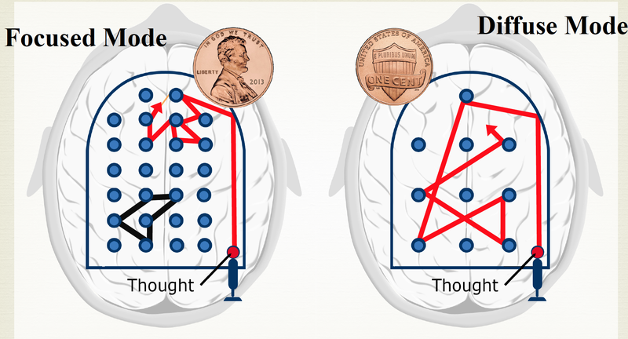
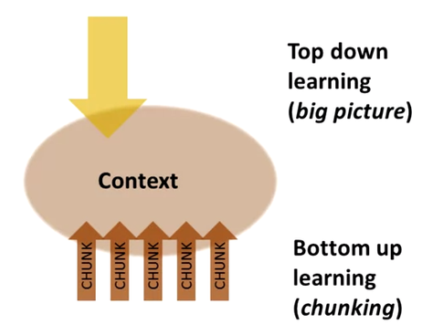

# Learning How To Learn

## Week 1

Focused/Diffuse Modes Thinking:
 * Focused is when you’re concentrating. Direct approach to solving familiar problems.
 * Focused: thoughts move through nicely-paved road of familiar notions (neural pattern looks very tight and directed).
 * Diffuse: Thoughts move widely. More of a broad/big-picture perspective trying to connect ideas from different places.
 * 
 * We’re always either in focused or diffuse mode of thinking.
 * Using diffuse mode:
    * Dali tactic: relax in his chair with a key in his hand and be woken by the clatter. Wake up and take new insights into focused mode.
    * Edison used a similar tactic with ball bearings and metal pans.
 * To learn something new we need to go back and force between focused and diffuse modes. 

Procrastination
 * Pain area of brain activated  when you consider doing something you don't want to do
 * But feeling of pain disappears after engaging the task
 * Promodoro technique:
    * 25 min timer
    * Turn off all interruptions
    * Focus
    * Reward yourself when done

Practice makes permanent
 * Neurons become linked together through repeated use.
 * The more abstract something is, the more important it is to practice to reinforce the neural thought patterns.
 * Practice strengthens the neural connections on each successive application.
 * When you’re learning, study hard by focusing intently and then take a break or change your focus to something else for a while.
    * This allows the diffuse mode to take over and the ’neural mortar’ to dry.
    * This is why cramming fails. The diffuse mode never gets a chance to kick in.

Introduction to memory
 * Long term memory
    * Need to revisit(repeat)  things at least a few times to improve the chance you’ll actually be able to retain and later find what you need.
    * Store fundamental concepts and techniques
    * Different kinds of long term memory are stored in different areas of brain
 * Working memory - what you are immediately processing in your mind
    * can contains about 4-7 chunks of information
    * Often need to repeat what you’re working with so it you have a chance to apply
    * When learning something new it falls into working memory and after some time and practice moves into long term memory
 * Short term memory - like a blackboard
 * Spaced Repetition Technique
    * Repeating over several days improves chance of remembering 

Importance of Sleep in Learning
 * Brain cells shrink when you sleep, creating space for accumulated toxins to be washed out.
 * Poor sleep => prevalence of metabolic toxins that inhibit thinking.
 * Sleep strengthens important parts of memories and erases the less important ones.
 * Brain also rehearses new concepts, especially the tougher aspects, and entrenches them more deeply.
 * Sleeping Technique:
    * go over what you’re learning about just before sleeping
    * consciously wanting to dream about it also increases the likelihood that your brain will contemplate that knowledge while sleeping

Learning Techniques From Dr. Sejnowski
  * Learning by doing or osmosis from experts is better than reading books.
  * Learn by active engagement rather than passive listening. Asking questions may lead to more interesting discussions. When lecture is boring -> try to ask questions.
  * Jogging, walking, exercising helps to switch to diffuse mode.
  * Take notebook during daydreaming with you to write down all the ideas
  * New neurons may be born in adulthood:
    * Enriched environment or surrounded by other people who will stimulate you.
    * Exercising
  * Success - from passion and persistence
  * Learn or create with other people -> help to look on old things with a new fresh eyes.

Interview with Dr. Robert Bilder on Creativity and Problem Solving:
  * No pain no gain
  * Openness and new experience is associated with with great achievement
  * Less agreeable people tend to show more creative achievements.
    * Disagreeableness tend to challenge prior conventions 
    * Hard to balance 
  * Power of 10 exercise - zooming in and zooming out from a problem.

Interview with Writing Coach Daphne Gray-Grant:
  * Diffuse mode for writing, Focused mode for editing
  * Use mind mapping for diffuse mode - sideways page (horizontally)
  * Abstract key ideas using mind mapping
  * Don't edit while you are writing

Study Strategies to Boost Learning
  * Practice testing - self testing or taking practice tests
  * Distributed practice - implement a schedule of practice that spreads our study activities over time
  * Interleaved practice - schedule of practice that mixes different kinds of material within a single study session
  * Self-explanation - explaining how new information is related to known information or explaining steps taken during problem solving
  * Rereading - restudying text material after initial reading
  * Highlighting and underlining
  * Summarization - summaries of to-be-learned texts
  * Imagery for text - form mental images of text materials while reading of listing

Note-taking tools and tips
  * Favor of writing notes in your own words
  * Review notes the same day created them and then on regular basis
  * Test yourself on a content by using flash cards or using Cornell notes(use key words on left side)
  * Note taking styles:
    * linear - like a book
    * non-linear - organize content in systematic, non-conventional way
      * Helps to make connections between idea units.
  * Note taking formats (http://web.archive.org/web/20170530180703/http://sas.calpoly.edu/asc/ssl/notetakingsystems.html):
    * Cornell method
      * use left margin to write down most significant sentences
      * use right area for all other content
      * area below for summary
    * Outlining method - best method except for math and science
      * Major point on the left
      * Indent more specific on the right
      * 
    * Mapping method - graphic representation of content
      * Relates each fact in idea to every other fact
    * Charting method (table) - for chronological content
    * Sentence method
      * Every new thought, fact or topic on a separate line

Growth Mindset and Education (https://onedublin.org/2012/06/19/stanford-universitys-carol-dweck-on-the-growth-mindset-and-education/)
  * Students **praised for the process they engaged in** - their effort, their strategies, their focus - they take on hard tasks and stick with then, even if they make a lot of mistakes.
  Stu

For a more productive life, daydream (http://www.cnn.com/2014/05/16/opinion/schulte-daydreaming-productivity/index.html):
  * When we idle our brain is more active.
  * In idle mode brain makes connections between different unconnected parts of brain and enables us to see old problems in a new light
  * Positive mood and taking relax - critical precursors to Aha moments
  * To be most creative - need switch between focused attention and daydreaming
  * Carry notebook during daydreaming to capture interesting ideas
  * Allow your employees to take time for daydreaming (like Google's 20%) -> this may bring innovate products to the company

[Double Your Reading Rate](https://www.scotthyoung.com/blog/2007/03/10/double-your-reading-rate/):
  * Reading is not linear - 
  * Stop subvocalizing - stop sounding words in your head
  * Practice reason - reading faster than you actually read
  * Use pointer to mark where you are on page right now
  * Eliminate distractions

[I Was Wrong About Speed Reading: Here are the Facts](https://www.scotthyoung.com/blog/2015/01/19/speed-reading-redo/):
  * Browse before you read and selectively pick up parts of information
  * Fluent recognition of words by just reading more
  * Know what you want before you read it
  * Deeper processing tasks to improve retention - paraphrase, note information you want to remember

## Week 2

How to make chunk:
  * Chunk help to unite different bits of information together through meaning and usage
  * Chunk is easier to remember and fit into larger picture
  * When stressed chunking does not work
  * Once you chunk the main idea/principle - you don't need to remember all the underlying details.
  * To learn something start with learning mini-chunks and later combine them into larger chunk
  * Learn math/science by using examples and solutions
    * Try to focus on why this particular step is next thing you should do.
  * How to form chunk:
    * Full focus on information you want to chunk
    * Understand basic idea you want to learn
      * Don't confuse 'Aha!' moment with solid expertise
      * After reading material - try to test and practice yourself
    * Context - understanding the big picture - how chunk fit in a big picture. Learn how chunks are connected and when or when not to use them.
      * Going beyond the initial problem and see more broadly
      * Means when to use this technique instead of some other technique
      * 
    * Practice and recall - will help to better remember and learn information
  * Try to do 2 min picture/captions walk through chapter you are planning to read to gain sense of the big picture.
    * Learn major concepts first
    * Fill in the details and missing peaces

Illusion of competence:
  * Recall(instead of rereading) - mental retrieval of the key ideas - after reading material - look away and see if you can recall it
    * Concept mapping, drawing diagrams that shows the relationship between concepts
    * Recalling in different environment rather than learning helps better remember material
  * Looking at the solution and thinking you truly know it yourself is one of the most common illusion of competence in learning
    * You must persist and process information in your memory if you want to master it
    * Try to minimize highlighting text in book - instead try to add your notes/main concepts on sides 
  * Test yourself on whatever you are learning
    * Mistakes can correct your thinking to learn better

Library of chunks:
  * Combining chunks in new and innovative ways is often the path to invention/creativity
  * Expertise - library of chunks
  * Transfer - some chunks may related to some other chunks in another fields
  * As you get more experience you will be able to crete bigger chunks
  * Diffuse mode can help to connect chunks together in a new ways to solve new problems.
  * Each new chunk will fill up it's part in a bigger picture
  * with time you can recognize different types and classes of problems that you will automatically know how to solve 
  * 2 ways to solve problems:
    * Sequential thinking - focused step by step reasoning
    * Holistic intuition - creative diffuse mode linking of several focused mode concepts
      * Solution not always correct - should be verified with focused mode
  * Law of Serendipity - luck favors the one who tries. becomes easier to form chunk with time.

Over-learning, Choking, Einstellung, and Interleaving
  * Over-learning - continue learning after you mastered what you can
    * Some time can be especially valuable. ex public speaking
  * Choking(Deliberate practice) - focusing on more difficult material to gain full mastery of the material
  * Einstellung - initial idea may prevent better idea to be found.
    * Sometimes initial intuitions is misleading
  * Interleaving - practicing jumping back and force between problems or situations that require different techniques/concepts/approaches or strategies.
    * Do what you can to mix up your learning
    * Interleaving between chunk in different fields can enhance your creativity
    * Developing expertise in many fields can help you to bring very new ideas from one field to another, but your expertise is not as deep as person who specialized in one discipline
      * Having expertise in one field you may become more deeply entrenched in your familiar way of thinking and not be able to handle new ideas
    * Most paradigm shifts in science are brought by either young people or people who were originally trained in a different discipline

[The 30 Second Habit That Can Have a Big Impact On Your Life](http://www.huffingtonpost.com/robyn-scott/the-30-second-habit-that-_b_4808632.html):
  * **Immediately after every lecture, meeting, or any significant experience, take 30 seconds - no more, no less to write down the most important points**

Interview with Dr. Norman Fortenberry - Learning at MIT:
  * Be part of the group to get access to some unique resources
  * Build community/team around you to give and get support
  * Teaching is best way to learn

Interview with Scrott Young, a "Marco Polo" of Learning:
  * Try to get into problems as soon as possible
  * Self-explanation - try to explain yourself how it work/how to solve problem
  * Find **simple analogies/metaphor** and try to fit them into things you are learning
  * **Always have a mission**

## Week 3

Procrastination:
  * Promodoro - to deal with procrastination
  * Usually procrastination is a result of feeling unhappy about something that’s difficult or painful.
  * Focus on process instead of product(which triggers pain).
    * Process - flow of time
    * Product is an outcome
    * Product triggers pain -> procrastination
    * Focus on process - on doing small pieces of task (Promodoro period) and don't worry about completion time.
  * Forming a habit to avoid procrastination:
    * The cue - recognize what launches you into procrastination mode
      * location, time, feeling, reactions
    * The routine - mind switching to this when it gets cue
      * plan - develope a new ritual - leave phone in car, settle in quiet space, favorite chair ...
    * The reward - emotionally payoff for doing the right things(not procrastinating)
      * can be something real (go to movie, etc)
      * can be set to specific time (eg 5:00pm)
    * The belief that you can do it
  * To keep focus on what you are trying to learn:
    * Weekly list of key tasks
    * Daily TODO list (evening before)
    * Commit yourself to certain routines and tasks each day
    * Have a deadline
    * Most important and disliked task first

Memory
  * Focusing attention bring something into your working memory, 
  * To move from working to long term memory:
    * Idea should be memorable
    * It must be repeated. better to repeat over several days
      * Writing and saying may enhance retention
      * Index cards - 
  * Meaningful groups and Memory Palace Technique
    * To use visual memory - try to make very memorable visual image representing one key item you want to remember. The funnier and provocative image, the better.
    * Crete meaningful groups that simplify memoization- associate information with something else what much easier to remember
      * The funnier and evocative image is, the better
    * Memory Palace - imagine all information you need to remember in some familiar place and use it like a notepad. Ideal for lists

Interview with 4 Time US Memory Champion Nelson Dellis:
  * Memory techniques:
    * Visualization - turn anything into picture that filled with association that means something to you
    * To remember names - use some distinguishing feature of them as a location 
  * To improve brain health
    * Keep brain active
    * Learn a new skill
    * Physical activity
    * Being social
    * Diet - use Omega3

## Week 4

How to become better learner
  * Physical exercises - allow neurons to be born in Hippocampus
  * Practice can repair and train the brain

Renaissance Learning and Unblocking your potential:
  * Learn using metaphor and analogy
    * The more visual - the better
    * Use stories to remember and retry information
  * Work profitably with teammates
  * Perform well on tests
  * Right hemisphere is responsible for global thinking
  * _Brainstorms with teammates_ help to find blind spots and errors in your knowledge
    * Explaining to others other helps
  * Start with hard problems and then jump to the easy ones
    * This will help to load hard problem into memory and switch to diffuse mode.
  *

## Others reviews
  * http://fabianilmberger.com/2016/10/02/a-mind-for-numbers-book-notes/
  * https://pastebin.com/JNbGxvpQ
